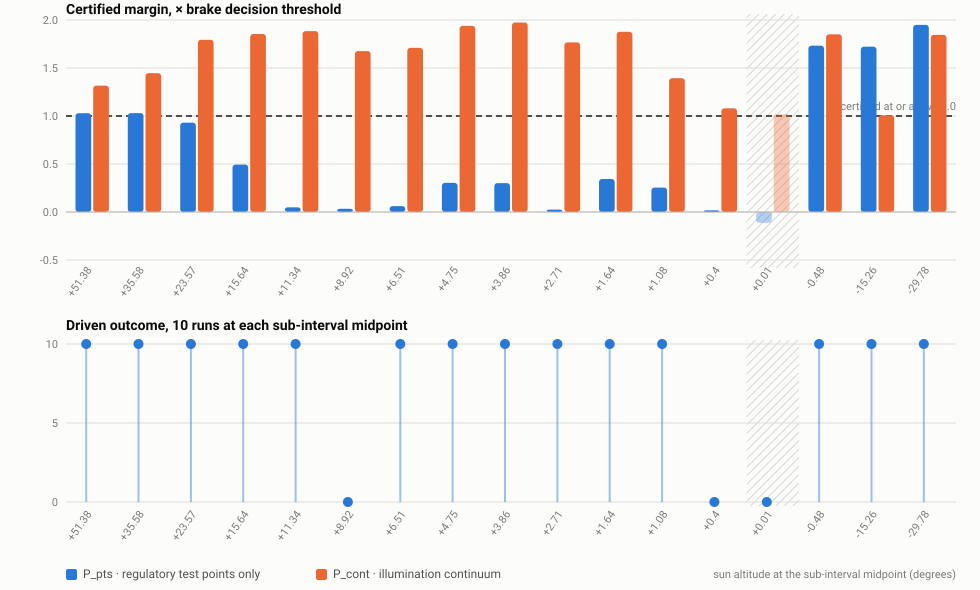

# formal-verification--aeb--code

[](LICENSE)
[](tools/)
[](https://carla.org)
[](https://github.com/Verified-Intelligence/auto_LiRPA)

Formal verification of automatic emergency braking under degraded visibility.

**Owner:** Zach. **Status:** rebuilding on a new map.

The study ran end to end once, on a small map, and that result is complete and tagged
`town01-final`. It then moved to a large map, because the small one had no site long enough
for the standard's false-activation test. That rebuild is not finished, and its results so
far are withdrawn: they were measured against networks that could not be trained again. The
training was made repeatable on 10 September 2026.

`python -m study.status` is the live state. `CLAUDE.md` is the design, current belief and
every standing rule. **First milestone:** demo at the automotive technology expo, Novi,
October 2026.

## What this is for

Certify that an AEB function meets its stopping requirement across a declared range of
illumination and contrast degradation, without running the test fleet.

The commercial artifact is one sentence:

> Here is the certified illumination and contrast envelope in which your pedestrian AEB
> meets its stopping requirement, computed without running the test fleet.

## Why AEB, and why first

1. **Regulatory anchor with a date.** FMVSS No. 127 (final rule, 89 FR 39686, May 9,
   2024, docket NHTSA-2023-0021) mandates AEB including pedestrian detection in darkness
   for light vehicles, compliance 1 September 2029 (small-volume 2030); Euro NCAP already
   scores night pedestrian AEB. Verified against the published rule 2026-08-25. The
   light-vehicle rule does not cover truck platforms; heavy-vehicle AEB is separate
   rulemaking.
2. **We already have the hard half.** The steering study established that night and shadows
   break a perception model that is fine in clear weather. That is exactly the condition the
   regulation targets.
3. **The hazard is localized by construction.** In lane keeping the safety threshold is a
   *sustained* error, and the peak statistic is dimensionally wrong for it. In AEB the hazard
   is a single event, so the peak should be the right quantity here.

## The scientific bet

If the peak statistic works for AEB and fails for lane keeping, the two results together
state a general principle: **match the certified statistic to the temporal structure of the
failure**, demonstrated with both failure modes of getting it wrong. That is stronger than
either result alone, and it is the reason to run this as a study rather than only as a demo.

## Scope

- A braking policy, a closed-loop AEB harness, and longitudinal dynamics, which the steering
  study deliberately held fixed.
- A safety specification **derived from primitives**, the way `delta_tol = 0.0120` was
  derived from lane width, vehicle width, wheelbase, speed and a 1.85 s reaction horizon.
  Candidate primitives here: stopping distance, minimum TTC, impact speed.
- The specification is a document and should be written before any code.

## Prior art in this lab

The steering study is the parent. Read, in this order:

- `formal-verification--steering--code/CLAUDE.md`
- `formal-verification--steering--code/REPRODUCING.md`
- `lab--future-plans--docs/RESEARCH_DIRECTIONS.md`, entry A1

Older notes point into that repository's `docs/` directory. It no longer has one. Its
`CLAUDE.md` carries what those files held, the same way this repository's does.

## Risk

The build is larger than it looks and the expo date is fixed. If it slips, the expo demo
falls back to the twelve canonical steering cells plus the occlusion result. Decide that
fallback early rather than late.

---

## Running this

The repository is public and is a **proof of concept**, not production code. It is meant to
be readable by someone outside the lab.

**Without a simulator**, which is most of what exists today:

```bash
python -m study.protocol_lock         # confirm the frozen design has not moved
python -m study.status                # where the study stands, in the protocol's terms
python -m study.ledger --check-order  # the blind protocol, checked against git history
python tools/survey_maps.py           # choose the test map from map geometry alone
python tools/condition_signature.py   # were the captures rendered at the illumination asked for
python tools/make_figure.py           # rebuild CLAUDE.md section 11's figure from the results
python tools/tidy.py                  # repo hygiene report
```

`tools/survey_maps.py` needs a CARLA **installation** for its map files, but not a running
server. Point it anywhere with `--carla`.

**With a simulator:**

```bash
bash scripts/bootstrap_env.sh         # builds .venv and PROVES a CUDA kernel runs
bash tools/carla_launch.sh            # THE launcher; the determinism flags are launch-time
bash scripts/rebuild_all.sh           # the whole study, M2 to M6, in dependency order
bash scripts/rebuild_all.sh witness   # M7, after the verdicts are committed
python tools/carla_jobs.py --list     # what is queued, in dependency order
python tools/probe_memory.py --help   # why a map is or is not usable on this hardware
```

`scripts/rebuild_all.sh` stops before M7 deliberately. The verification verdicts have to
be committed to git before the corresponding drive, because that ordering is what makes a
verdict a prediction rather than a description, and a script that committed them for you
would turn it into a formality.

## The result

`docs/STUDY_REPORT.md` is the complete methodology and results in one file. **It describes
the small-map study**, which is the one that ran end to end. The rebuild on the large map
supersedes its map choice and is not finished, so read the report for the method and
`python -m study.status` for where things stand.

The claim under test is unchanged: a policy that passes both endpoint lighting conditions
fails between them; the certificate names those illuminations without simulating, and the
verdicts are committed to version control before any vehicle moves
(`python -m study.ledger --check-order` verifies that ordering against git).

<p align="center">
  
</p>

Interactive version: `docs/figures/dusk_gap.html`. Both come from
`python tools/make_figure.py` and nothing here is drawn by hand. The image is the vector
file for that reason: a bitmap sat here for two weeks after the numbers under it changed,
because no committed tool regenerates one.

## Layout

| | |
|---|---|
| `CLAUDE.md` | the study design, frozen. Start here |
| `study/` | the lock, the status report, and recorded results |
| `tools/` | everything runnable |
| `CLAUDE.md` | **current belief, the standing rules and every working note.** Start here if you are picking this up |
| `docs/STUDY_REPORT.md` | **complete methodology and results.** Start here for the science |
| `docs/ARXIV_NOTES.md` | everything the paper repository needs |
| `docs/` | the pre-registration and the figures |
| `results/` | outputs. Large artefacts are git-ignored |
| `stale/` | files on their way out, git-ignored. Inspect and delete |

## Housekeeping

Before pushing anything you want read by someone else, run `python tools/tidy.py`. Delete
nothing by hand in anger: move it to `stale/` instead, look at it later, then remove it.
Anything that was ever committed stays in git history, so parking a file loses nothing.

## License

Apache License 2.0. See [LICENSE](LICENSE) and [NOTICE](NOTICE).
